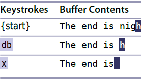

#Tip9: Compose Repeatable Change  
  
`Goal`: delete the word `nigh`  
  
##Delete Backward  
  
  
##db  
>delete from the cursor's starting position to the beginning of the word, but it leaves the final **h** intact.  
**comment**: dot repeats the single character deletion(`.` == `x`)  
  

##Delete Forward  
  
  
##b  
>put the cursor into position of the starting of the word.  
  

##dw  
>delete from the cursor position to the begining of the next word.  
**comment**: dot isn't useful cause cursor is already at end of the line(no next word).  at least: `.` == `dw`
  
##Delete an Entire Word  
  
  
##daw  
>delete the current word and also delete a whitespace character.  
**comment**: dot repeats the instruction to delete a word. `.` == `daw`  
  
#[<<Tip8](tip8.md)  [Tip10>>](tip10.md)
